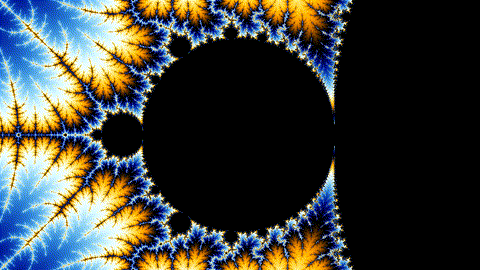
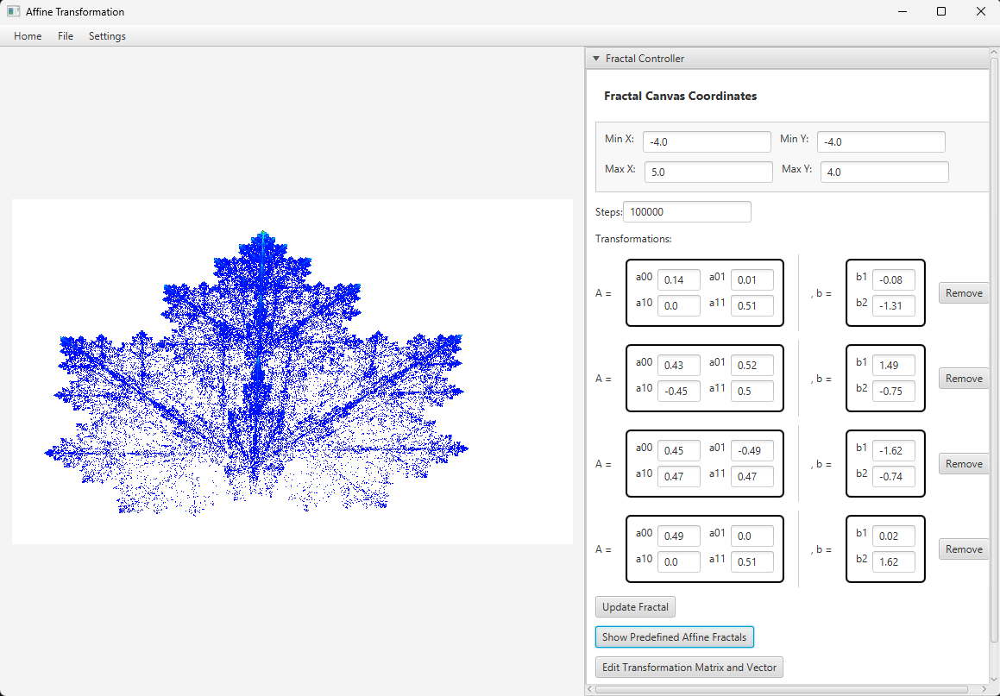
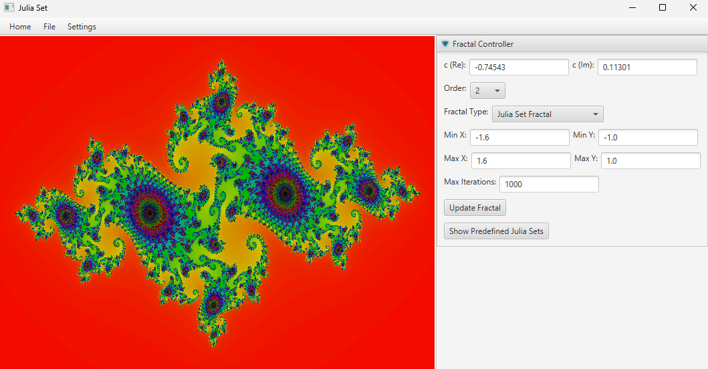

# Chaos Game – Fractal Generator

A JavaFX desktop application for creating and exploring fractals using chaos game algorithms, affine transformations, and Julia sets.

## Demo

*Fractal zoom GIF from Wikimedia Commons.*

## Preview

### Affine transformation fractal

### Julia set fractal

## Features

- Generate predefined fractals
- Explore Julia sets
- Edit affine transformation matrices and vectors
- Adjust canvas coordinates, iterations, and fractal parameters
- Save and load fractal configurations

## Tech Stack

- Java 21
- JavaFX
- Maven
- JUnit

## Run Locally

Clone the repository:

    git clone https://github.com/shekhe9920/chaos-game.git
    cd chaos-game

Run the application:

    mvn javafx:run

Run tests:

    mvn test

## About

Developed as part of the IDATG2003 System Development course at NTNU Gjøvik.

## Credits

Mandelbrot zoom GIF: “Self-Similarity-Zoom.gif” by Danielkwalsh, via Wikimedia Commons  
https://commons.wikimedia.org/wiki/File:Self-Similarity-Zoom.gif  
Licensed under CC BY-SA 4.0.